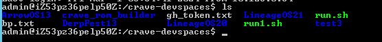
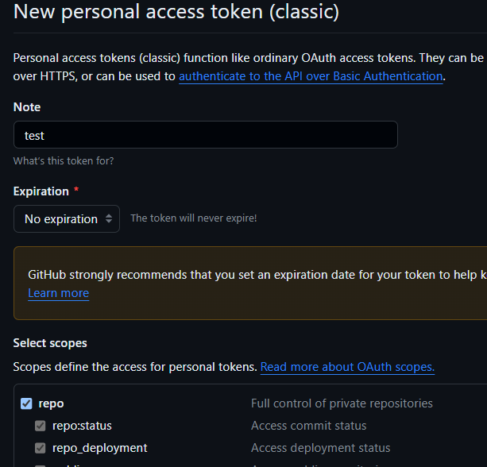
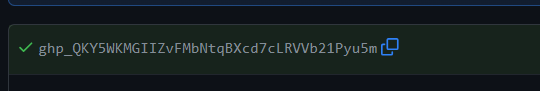
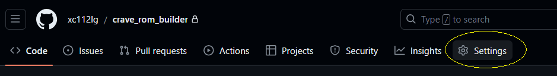
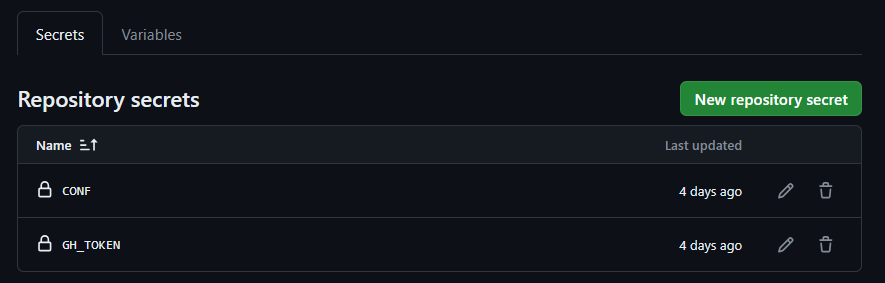
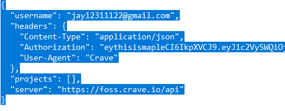

# crave_rom_builder
what's the diffirent to its predecessor?
This is a workaround so it can work also by logging in with devspace and check your build in there.
Workfolder will be the same as in the base projects i use in workflow



## Prerequisites 
foss.crave.io account

## Setup Instructions
- Download crave.conf from API Keys of foss.crave.io dashboard
- Fork this repo
- Create a Personal access tokens (classic) https://github.com/settings/tokens Check all options except with the delete options, its your choice how to long you want the code to work, you can update it afterward on GH_TOKEN everytime it expire or you can choose no expiration

- after doing that you will get like  
- save it for later
- Now Go to (repo) Settings -> Security -> Secrets and Variables -> Actions
- 

- Create a Repository Secret called CONF, copy whole code from crave.conf and paste it
- 
- Create a Repository Secret called GH_TOKEN, now paste the code you get in Personal access tokens (classic)

## Inputs Explanation
### Base Project
    - These are the projects everyone can build, with a foss.crave.io account
    - These are the ones officially added
### Repo init Command
    - This is only for when you are initializing another ROM. When doing this, ensure you are initializing on top of closest cousin base project
    - Don't initialize android 14 on top of android 13 projects
    - Incase you are building more that 2 android 14 projects and you want to keep projects intact without deleting them, you can use other base project  to work with,
### Removals
    - When we resync another ROM on top, we are bound to get "cannot checkout" errors. To fix this, we add that folder to the Removals tab
    - Add a space after .repo/local_manifests and add these folders. Don't change if you don't need to
### Local Manifest
    - Here you enter the git repo and branch for your local manifests, containing device specific repositories. These will be cloned to .repo/local_manifests
### Device Details
    - Enter the device codename you want to build for inside DEVICE_NAME
    - Enter the makefile name(without the .mk) inside MAKEFILE_NAME
    - e.g lineage_h872
### Build Command
    - eg. m updatepackage, mka bacon, make recoveryimage
### Build Type
    - Choose the build type
- user:  Limited access; suited for production

- userdebug:  Like user but with root access and debug capability; very close to production performance

- eng:  Development configuration with faster build time; most suited for day-to-day development
### Extra Command
  If you need to delete folder or do git clone
   ```bash 
    rf device/lge/msm8996-common;git clone https://github.com/xc112lg/android_device_lge_msm8996-common -b evo4 device/lge/msm8996-common
   ```
### Clean Build
  - Uses fresh Base Project sources without any of our changes(use only for testing/debugging)
  - Selecting Yes here will reset the data to its default state removing any of your work, Ask in discord if you dont understand this option, If i see builders spamming yes on this option i will cancel their build
## TO MAKE THINGS EASIER IN BUILDING
  - Since there is 4 base projects that can be use, i suggest only maintain 4 diffirent roms to work with

## Known Issues
  - You Tell Me :)
## Extra Info
  - For scheduled builds, it's better to remove the workflow dispatch stuff.
  - This Repo is a spiritual successor to azwhikaru's Action-TWRP-Builder
## Credits!
  - [AntoninoScordino](https://github.com/AntoninoScordino)[sounddrill31](https://github.com/sounddrill31) Cause im too lazy to fucking make my own readme
  - [azwhikaru's Action-TWRP-Builder](https://github.com/azwhikaru/Action-TWRP-Builder) Which I used as reference
  - [Other contributors](https://github.com/xc112lg/crave_rom_builder/graphs/contributors)
  - [The crave team](https://github.com/accupara) for the build servers and helping us out when we get stuck
